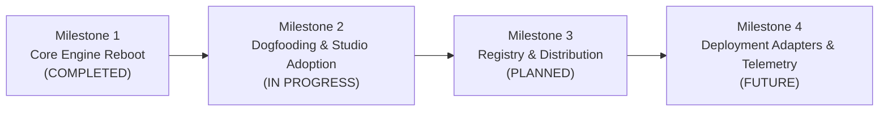

# Mozole CLI v2 — Strategic Intent, Technical Architecture & Roadmap

> **Authoritative Specification Document**  
> **Repository:** `MozoleCli` (`@mozole/cli`)  
> **Audience:** Core Engineering Team, Autonomous Agents & System Reviewers

---

## 1. Project Purpose & Executive Rationale

### 1.1 The Context & The Problem
The previous generation of Mozole CLI contained architectural baggage: heavy runtime hooks, an invasive local disk-hashing context engine (CCE), a rigid runtime token governor that intercepted shell commands, and bulky Playwright-driven screenshot visual diffing suites. This created high friction in fast-paced autonomous development workflows and added runtime overhead to client repositories.

### 1.2 The Core Mission
Mozole CLI v2 is a ground-up reboot engineered specifically for **Mozole Studio**. Its mission is two-fold:
1. **Agent-Oriented Scaffolding Engine:** Deliver instant, zero-bloat project generators that provide autonomous engineering agents and developer tooling with explicit, non-ambiguous architectural guardrails, canonical tokens, and sequential development discipline.
2. **Deterministic Development Cockpit:** Provide developers and agents with a lightweight CLI and interactive terminal cockpit (`mozole ui` / `mozole verify`) that enforces design token contracts, accessibility compliance, and code quality without capturing a single raster screenshot.

---

## 2. Technical Architecture: What It Does & How It Works

### 2.1 Universal Engine & Dual Frontend Profiles
Both frontend profiles run on **Vite** for sub-second HMR and deterministic ESM builds:

1. **Standard Production Profile (Default):**
   - **Stack:** React 19 + React Router 7 (Framework Mode Plugin) + Static Site Generation (SSG pre-rendering) + Tailwind CSS v4.
   - **Target:** Production marketing websites, corporate portals, content-rich studio platforms.
   - **Primitives:** Bespoke UI components in `src/components/ui/` backed by unstyled Radix UI primitives (`@radix-ui/react-dialog`, `@radix-ui/react-slot`), strictly adhering to project tokens.

2. **Flagship Creative Profile (`--flagship`):**
   - **Stack:** React 19 + Wouter (Headless Micro-Router) + Lenis (Smooth Scroll) + Motion + Tailwind CSS v4.
   - **Layering:** Independent 60fps persistent Canvas/WebGL background layer (`<CanvasLayer />`) decoupling ambient visual craft from route transitions.
   - **Target:** Awwwards-grade studio showcases, experimental portfolios, high-fidelity interactive digital experiences.

---

### 2.2 Pure PHP 8.1+ Zero-Dependency Backend
Tailored for deployment on budget shared hosting (e.g., standard cPanel environments constrained by 250k Inodes, 25 MB/s I/O limits, and Imunify360 security filters) with zero Composer dependencies:

- **Directory Structure:** `api/index.php`, `api/config.php`, `api/mailer.php`, `api/.htaccess`.
- **5-Layer Security Defense:**
  1. **Origin & Referer Verification:** Rejects cross-origin CSRF attacks and untrusted domains against `allowed_origins`.
  2. **Zero-Friction Honeypot:** Traps automated bot spam via hidden fields (`_mozole_website_url`) without user CAPTCHA friction.
  3. **File-Based IP Rate Limiting:** Enforces bounded request quotas (e.g., 5 submissions per 5 minutes per IP) using file locking (`LOCK_EX`) in a temporary storage window.
  4. **Direct File Denial:** `.htaccess` rules deny direct HTTP access to `config.php` and enforce strict request verbs (`GET`, `POST`, `OPTIONS`).
  5. **Header Injection Prevention:** Strips CRLF (`\r`, `\n`) injection characters and validates recipient MIME structures using native PHP `mail()`.

---

### 2.3 Single Source of Truth: Canonical Design Tokens
To eliminate token drift between CSS variables and utility classes:
- **Canonical Location:** `src/styles/tokens.css`.
- **Syntax:** Tailwind v4 `@theme` block declaring color palettes, semantic typography roles (`--font-display`, `--font-body`, `--font-mono`), fluid typography scales via CSS `clamp()` (`--text-xs` through `--text-5xl`), spacing scales, and solid shadow tokens (zero excessive blur).
- **Enforcement:** Components and application styles must consume tokens via utility classes or `var(--...)`. Raw hex/rgb/hsl literals in component CSS are prohibited.

---

### 2.4 Mozole Quality Kit (Screenshot-Free Headless QA)
Routine automated QA never captures, compares, or stores raster screenshots. Quality is verified deterministically through:

1. **Static PostCSS AST Contract Auditor (`src/qa/contract.ts`):**
   - 50ms AST traversal of all stylesheets.
   - Flags literal colors, `transition: all`, undefined custom properties without fallback, raw font families, and unscaled font sizes as **ERROR**.
   - Flags fixed canvas dimensions (e.g., `width: 1440px`, `375px`) as diagnostic **WARN** to accommodate legitimate device mockup components while preventing unsemantic design-tool transcriptions.
2. **In-Browser Headless DOM Geometry Probe (`src/qa/probe.ts`):**
   - Zero-dependency script executed inside browser context.
   - Measures live page reflow: page-wide horizontal overflow (`scrollWidth > innerWidth + 1`), element overflow outside viewport (exempting explicit horizontal scroll containers).
   - Validates text clipping against ancestors with `overflow: hidden` or `overflow: clip`.
   - Enforces font floors: 12px minimum for body text, 16px minimum for mobile inputs (`<input>`, `<select>`, `<textarea>`) to prevent iOS Safari auto-zoom.
   - Enforces minimum 24px standalone interactive touch targets.
   - Validates `(prefers-reduced-motion: reduce)` by catching active animations or smooth scrolling.
3. **Breakpoint Boundary Calculator (`src/qa/breakpoints.ts`):**
   - Extracts all media query breakpoints from CSS and tests boundary thresholds: `[point - 1, point, point + 1]`.
4. **Static HTML & Accessibility Auditor (`src/qa/a11y.ts`):**
   - Enforces `html[lang]`, exactly one `<h1>` per page, single `<main>` landmark, skip-to-content keyboard link, unique element IDs, and descriptive image `alt` attributes.

---

### 2.5 10-Step Phased Development Discipline (`docs/phases/status.md`)
Project lifecycle is strictly partitioned into 11 phases (Phase 00 init through Phase 10 launch):
- **Phase 00:** Project Initialization & Contracts
- **Phase 01:** Core Architecture & Layout
- **Phase 02:** Design Tokens & Primitive Components
- **Phase 03:** Primary Routes & Pages
- **Phase 04:** Interactive Features & State
- **Phase 05:** Dynamic Animation & Canvas (Flagship)
- **Phase 06:** Backend Integration & Security
- **Phase 07:** Accessibility & WCAG 2.1 AA
- **Phase 08:** Performance & Core Web Vitals
- **Phase 09:** Browser & Breakpoint QA
- **Phase 10:** Production Readiness & Launch

**Operational Rules:**
- Initial development must advance sequentially. Agents run `mozole phase next` to advance, which commits progress using Conventional Commits (`feat(phase-XX): ...`).
- **Post-Launch Maintenance:** After Phase 10 is reached, bug fixes and routine maintenance do not require reopening phases unless architectural contracts are modified (`mozole phase reopen <id>`).

---

### 2.6 Architectural Fihrist & Design Evidence
- **`docs/repomap/`:** Continuously tracked indices of `architecture.md`, bespoke primitives in `components.md`, application views in `routes.md`, and semantic tokens in `tokens.md`.
- **`docs/design/`:** Reference evidence store containing `design.md`, `brief.md`, exported screens, and vector assets. Guardrails establish that exported designs are evidence, not executable code—preventing raw CSS transcription that bypasses token systems.

---

### 2.7 Subprocess Safety & Deterministic Verification
- All subprocess execution is wrapped in argument arrays with `shell: false`. Signals (`SIGINT`, `SIGTERM`, `exit`) are trapped to ensure zero zombie processes or orphan dev servers.
- `mozole verify`: Deterministic gate running AI trace scanning, Biome linting, TypeScript compilation, design contract AST audit, and accessibility hierarchy validation.
- **Pre-existing & Environmental Failure Handling:** If an agent encounters a failure caused by missing environment runtimes (e.g. system PHP missing in a frontend container) or pre-existing tool breakage, it may report completion provided it proves its own changes introduced zero regressions.

---

## 3. Command Matrix

| Command | Signature | Description |
| :--- | :--- | :--- |
| **`new`** | `mozole new <name> [--flagship] [--backend=php\|node]` | Generates a complete verified client project |
| **`prototype`** | `mozole prototype init` | Initializes a multi-project prototype workspace (`projects/`, `shared/`) |
| **`adopt`** | `mozole adopt [path]` | Injects Mozole governance, policies, phases, and tokens into an existing repo |
| **`phase`** | `mozole phase [status\|next\|reopen]` | Inspects, advances, or reopens development phases |
| **`repomap`** | `mozole repomap [sync\|check]` | Audits and synchronizes `docs/repomap/` architectural fihrist |
| **`test`** | `mozole test [contract\|a11y\|all]` | Runs PostCSS token contract audits and static accessibility checks |
| **`verify`** | `mozole verify` | Runs the full multi-stage deterministic quality gate |
| **`doctor`** | `mozole doctor` | Inspects Node.js (>=20), Git, PHP, and network port availability |
| **`ui`** | `mozole ui` (or bare `mozole`) | Launches the interactive terminal cockpit |

---

## 4. Product & Engineering Roadmap

### Milestone 1: Core Engine Reboot (Completed & Verified)
- [x] Legacy codebase archived cleanly to `archive/`.
- [x] Lightweight runtime dependencies configured (`citty`, `picocolors`, `postcss`, `prompts`).
- [x] PostCSS contract auditor, DOM geometry probe, and a11y auditor built.
- [x] Standard (React Router 7 SSG) and Flagship (Wouter + Lenis + Canvas) scaffolding engines built.
- [x] Pure PHP 8.1+ zero-dependency backend with 5-layer security implemented.
- [x] 10-step atomic phases (`docs/phases/status.md`) and repomap fihrist (`docs/repomap/`) built.
- [x] Subprocess management, TUI cockpit, and CLI router wired.
- [x] Verification suite passing 100% (20/20 unit & integration tests, Biome lint, TypeScript typecheck, build).

### Milestone 2: Dogfooding & Studio Adoption (Immediate Focus)
- [ ] **`MozoleSite` Adoption:** Run `mozole adopt ~/Dev/MozoleSite` to bring the agency's primary site under Mozole CLI v2 governance and verify parity with existing design contracts.
- [ ] **Real Client Prototype Generation:** Exercise `mozole prototype init` and `mozole new` across multi-project studio workspaces.
- [ ] **Agent Workflow Validation:** Test end-to-end task cycles under `AGENTS.md` policy rules and verify sequential advancing through phases 00 to 10.

### Milestone 3: Packaging, Registry & Distribution
- [ ] Publish `@mozole/cli` v2.0.0 to private studio npm registry or public npm with binary alias `mozole`.
- [ ] Pre-compile standalone executables or npx distribution (`npx @mozole/cli new <name>`).
- [ ] Add shell auto-completion for bash, zsh, and fish.

### Milestone 4: Deployment Adapters & Production Automation
- [ ] **Shared Hosting Deployment Pipeline:** Zero-downtime FTP/SSH rsync adapter deploying compiled static bundles to `public_html/` and PHP endpoints to `api/`.
- [ ] **Static Host Adapters:** Automated output tuning for Cloudflare Pages, Vercel, and Netlify.
- [ ] **Lighthouse CI Integration:** Optional post-phase 08 Core Web Vitals CI assertion (`>= 95` score gate).
